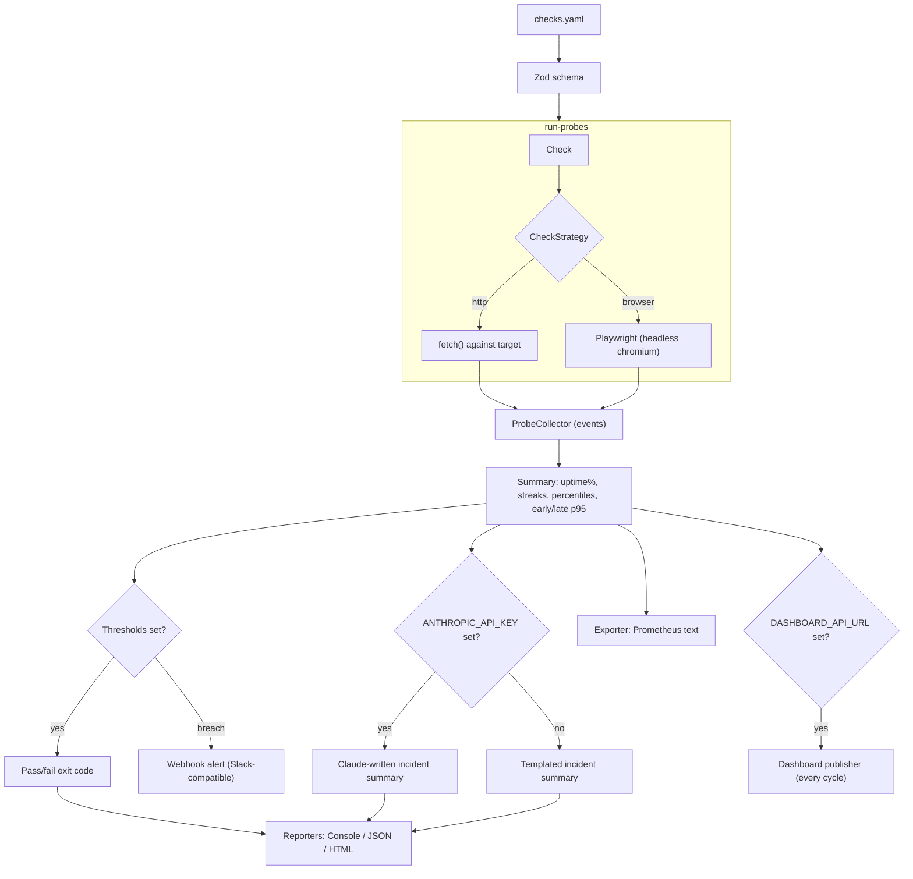

# Uptime Probe

[](https://github.com/urielabin/uptime-probe/actions/workflows/ci.yml)
[](LICENSE)

Declarative synthetic monitoring from a YAML check file — real HTTP and real-browser checks, uptime/latency thresholds as a CI gate, Slack-compatible webhook alerts, and a Prometheus exporter. Core is fully local and free; an LLM-written incident summary is an optional layer on top.

## Architecture



## Stack

| Layer | Technology |
|---|---|
| CLI | Commander |
| Config | YAML + Zod |
| Checks | Node.js `fetch` (HTTP), Playwright (browser) |
| Reports | Hand-rolled SVG charts (no chart library) |
| Metrics export | Prometheus exposition format |
| Alerting | Slack-compatible webhook POST |
| Dashboard publishing (optional) | HTTP POST to a hosted dashboard |
| LLM (optional) | Claude via `@anthropic-ai/sdk` |
| Testing | Vitest (unit + real HTTP/browser/webhook integration against a fixture server) |
| CI | GitHub Actions |

## Design patterns

- **Strategy** — `CheckStrategy` (`http` / `browser`) runs one check and returns a `ProbeOutcome`
- **Factory** — `createCheckStrategy` picks the strategy from a check's `type`
- **Observer** — `ProbeCollector` extends `EventEmitter`, emitting a `result` event per check run; `watch` mode is a real second consumer of this event (prints a live status line as results land), not just an unused affordance
- **Reporter** — Console/JSON/HTML implementations, tied to the CI-gating `ReportContext`
- **Exporter** — `PrometheusExporter` (file-format output only), split into a pure formatter (`prometheus.ts`, unit-testable without touching disk) and a file-IO wrapper
- **Optional AI layer** — `createIncidentSummaryGenerator()` picks a Claude-backed generator when `ANTHROPIC_API_KEY` is set, otherwise a deterministic templated one — never a hard dependency
- **Optional dashboard publisher** — `createDashboardPublisher()` picks an `HttpDashboardPublisher` when `DASHBOARD_API_URL`/`DASHBOARD_API_KEY` are set, otherwise a `NullPublisher` — never a hard dependency, fires unconditionally every cycle (not gated on threshold breach like the webhook alerter)

## Commands

```bash
npm install
npx playwright install --with-deps chromium   # needed once for browser checks
npm run fixture-server   # optional local target to try checks against
npm run dev -- run checks/smoke.yaml --json report.json --html report.html --prom report.prom
npm test
npm run lint
npm run typecheck
npm run build
```

## Check format

```yaml
name: production api
checks:
  - name: homepage
    type: http
    url: https://example.com/
    expectStatus: 200
    maxLatencyMs: 400
  - name: checkout page renders
    type: browser
    url: https://example.com/checkout
    expectText: Add to cart
    maxLatencyMs: 4000
  - name: api health
    type: http
    url: https://api.example.com/health
    bodyContains: '"status":"ok"'
    maxLatencyMs: 250
intervalSeconds: 60
thresholds:
  minUptimePercent: 99.5
  maxLatencyP95Ms: 800
  maxConsecutiveFailures: 3
alerting:
  webhookUrl: https://hooks.slack.com/services/T000/B000/XXXX
```

`probe run <config>` runs every check once and exits non-zero if any threshold is violated, so it can gate a CI pipeline. `probe watch <config>` polls continuously on `intervalSeconds` (or `--interval`), rewriting reports each cycle and firing a webhook alert only on the pass→fail transition — it never terminates, so it's for local/long-running use, not CI. Set `ANTHROPIC_API_KEY` for a Claude-written incident summary; without it, a deterministic templated summary is used. Set `DASHBOARD_API_URL` and `DASHBOARD_API_KEY` to push every run to a hosted dashboard (e.g. [uptime-probe-dashboard](https://github.com/urielabin/uptime-probe-dashboard)) — checks, metrics, thresholds, and the Prometheus exporter are always free and local either way.
